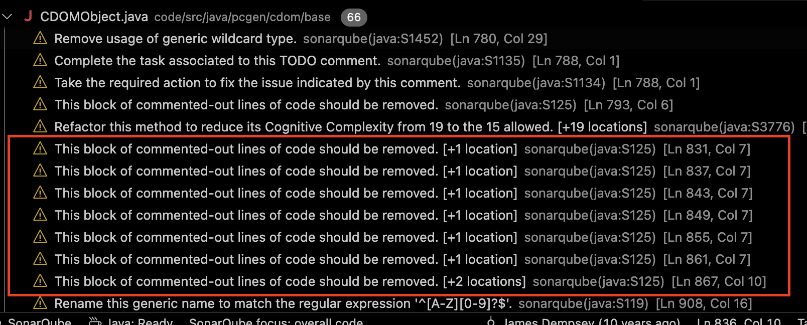

# Static Analysis Report

## Tool Used
SonarQube for IDE

## Key Findings
**Code Smell (Rule S125):** Commented-out code detected in `CDOMObject.java`
- Example line: 831, 837, 843, etc.
- Description: "Blocks of commented-out code should be removed to keep the codebase clean and maintainable."

**SonarQube Detection Screenshot:**

*SonarQube highlighting multiple commented-out code blocks in `CDOMObject.java` (Rule S125).*

## Fix Summary
Removed multiple commented-out code sections in `CDOMObject.java` that were no longer used.
The lines were remnants of older logic and are now tracked in version control, so manual preservation is unnecessary.

**CDOMObject.java | Before:**
```java
if (integerChar == null ? cdo.integerChar != null : !integerChar.equals(cdo.integerChar))
		{
			// System.err.println("CDOM Inequality Integer");
			// System.err.println(integerChar + " " + cdo.integerChar);
			return false;
		}
		if (stringChar == null ? cdo.stringChar != null : !stringChar.equals(cdo.stringChar))
		{
			// System.err.println("CDOM Inequality String");
			// System.err.println(stringChar + " " + cdo.stringChar);
			return false;
		}
		if (formulaChar == null ? cdo.formulaChar != null : !formulaChar.equals(cdo.formulaChar))
		{
			// System.err.println("CDOM Inequality Formula");
			// System.err.println(formulaChar + " " + cdo.formulaChar);
			return false;
		}
		if (variableChar == null ? cdo.variableChar != null : !variableChar.equals(cdo.variableChar))
		{
			// System.err.println("CDOM Inequality Variable");
			// System.err.println(variableChar + " " + cdo.variableChar);
			return false;
		}
		if (objectChar == null ? cdo.objectChar != null : !objectChar.equals(cdo.objectChar))
		{
			// System.err.println("CDOM Inequality Object");
			// System.err.println(objectChar + " " + cdo.objectChar);
			return false;
		}
        ...
```

**CDOMObject.java | After:**

```java
if (integerChar == null ? cdo.integerChar != null : !integerChar.equals(cdo.integerChar))
		{
			return false;
		}
		if (stringChar == null ? cdo.stringChar != null : !stringChar.equals(cdo.stringChar))
		{
			return false;
		}
		if (formulaChar == null ? cdo.formulaChar != null : !formulaChar.equals(cdo.formulaChar))
		{
			return false;
		}
		if (variableChar == null ? cdo.variableChar != null : !variableChar.equals(cdo.variableChar))
		{
			return false;
		}
		if (objectChar == null ? cdo.objectChar != null : !objectChar.equals(cdo.objectChar))
		{
			return false;
		}
        ...
```

**SpellCasterChoiceSet.java | Before:**
```java
	for (PCClass pcc : allClasses.getContainedObjects())
	{
		TYPE: for (String type : spelltypes)
		{
			String spelltype = pcc.getResolved(fk);
			if (type.equalsIgnoreCase(spelltype) && pc.getClassKeyed(pcc.getKeyName()) != null)
			{
				returnSet.add(pcc);
				break TYPE;
			}
		}
	}
```

**SpellCasterChoiceSet.java | After:**
```java
	for (PCClass pcc : allClasses.getContainedObjects())
	{
		int i = 0;
		while (i < spelltypes.size())
		{
			String type = spelltypes.get(i);
			String spelltype = pcc.getResolved(fk);
			if (type.equalsIgnoreCase(spelltype) && pc.getClassKeyed(pcc.getKeyName()) != null)
			{
				returnSet.add(pcc);
			}
			i++;
		}
	}
```
**AbstractReferenceContext.java | Before:**
```java
...
public <T extends Loadable> Collection<T> getConstructedCDOMObjects(Class<T> c)
	{
		// if (CategorizedCDOMObject.class.isAssignableFrom(c))
		// {
		// return categorized.getAllConstructedCDOMObjects((Class) c);
		// }
		// else
		// {
		return getManufacturer(c).getAllObjects();
		// }
	}
...
public Set<Object> getAllConstructedObjects()
	{
		Set<Object> set = new HashSet<>();
		for (ReferenceManufacturer<?> ref : getAllManufacturers())
		{
			set.addAll(ref.getAllObjects());
		}
		// Collection otherSet = categorized.getAllConstructedCDOMObjects();
		// set.addAll(otherSet);
		return set;
	}
...
public void buildDerivedObjects()
			...

			pcc.put(ObjectKey.CLASS_SPELLLIST, csl);
			// simple.constructCDOMObject(SPELLPROGRESSION_CLASS, key);
			// Collection<CDOMSubClass> subclasses = categorized
			// .getConstructedCDOMObjects(SUBCLASS_CLASS, SubClassCategory
			// .getConstant(key));
			// for (CDOMSubClass subcl : subclasses)
			if (pcc.containsListFor(ListKey.SUB_CLASS))
			{
				SubClassCategory cat = SubClassCategory.getConstant(key);
				boolean needSelf = pcc.getSafe(ObjectKey.ALLOWBASECLASS);
				for (SubClass subcl : pcc.getListFor(ListKey.SUB_CLASS))
				{
					String subKey = subcl.getKeyName();
					if (subKey.equalsIgnoreCase(key))
					{
						//Now an error to explicitly create this match, see CODE-1928
						Logging.errorPrint("Cannot explicitly create a SUBCLASS that matches the parent class.  "
							+ "Use ALLOWBASECLASS.  " + "Tokens on the offending SUBCLASS line will be ignored");
						pcc.removeFromListFor(ListKey.SUB_CLASS, subcl);
						continue;
					}
					skl = constructCDOMObject(CLASSSKILLLIST_CLASS, subKey);
					if (isMonster)
					{
						skl.addType(Type.MONSTER);
					}
					subcl.put(ObjectKey.CLASS_SKILLLIST, skl);
					// TODO Need to limit which are built to only
					// spellcasters...
					csl = constructCDOMObject(CLASSSPELLLIST_CLASS, subKey);
					if (spelltype != null)
					{
						csl.addType(Type.getConstant(spelltype));
					}
					subcl.put(ObjectKey.CLASS_SPELLLIST, csl);
					// constructCDOMObject(SPELLPROGRESSION_CLASS, subKey);
					/*
					 * CONSIDER For right now, this is easiest to do here, though
					 * doing this 'live' may be more appropriate in the end.
					 */
					subcl.setCDOMCategory(cat);
					importObject(subcl);
				}
				if (needSelf)
				{
					SubClass self = cat.newInstance();
					self.setKeyName(key);
					importObject(self);
				}
			}

```

**AbstractReferenceContext.java | After:**
```java
...
public <T extends Loadable> Collection<T> getConstructedCDOMObjects(Class<T> c)
	{
		return getManufacturer(c).getAllObjects();
	}
	...
public Set<Object> getAllConstructedObjects()
	{
		Set<Object> set = new HashSet<>();
		for (ReferenceManufacturer<?> ref : getAllManufacturers())
		{
			set.addAll(ref.getAllObjects());
		}
		return set;
	}
	...
public void buildDerivedObjects()
			...
			pcc.put(ObjectKey.CLASS_SPELLLIST, csl);
			if (pcc.containsListFor(ListKey.SUB_CLASS))
			{
				SubClassCategory cat = SubClassCategory.getConstant(key);
				boolean needSelf = pcc.getSafe(ObjectKey.ALLOWBASECLASS);
				for (SubClass subcl : pcc.getListFor(ListKey.SUB_CLASS))
				{
					String subKey = subcl.getKeyName();
					if (subKey.equalsIgnoreCase(key))
					{
						//Now an error to explicitly create this match, see CODE-1928
						Logging.errorPrint("Cannot explicitly create a SUBCLASS that matches the parent class.  "
							+ "Use ALLOWBASECLASS.  " + "Tokens on the offending SUBCLASS line will be ignored");
						pcc.removeFromListFor(ListKey.SUB_CLASS, subcl);
						continue;
					}
					skl = constructCDOMObject(CLASSSKILLLIST_CLASS, subKey);
					if (isMonster)
					{
						skl.addType(Type.MONSTER);
					}
					subcl.put(ObjectKey.CLASS_SKILLLIST, skl);
					// TODO Need to limit which are built to only
					// spellcasters...
					csl = constructCDOMObject(CLASSSPELLLIST_CLASS, subKey);
					if (spelltype != null)
					{
						csl.addType(Type.getConstant(spelltype));
					}
					subcl.put(ObjectKey.CLASS_SPELLLIST, csl);
					/*
					 * CONSIDER For right now, this is easiest to do here, though
					 * doing this 'live' may be more appropriate in the end.
					 */
					subcl.setCDOMCategory(cat);
					importObject(subcl);
				}
				if (needSelf)
				{
					SubClass self = cat.newInstance();
					self.setKeyName(key);
					importObject(self);
				}
			}


```


## Group Contributions

| **Member** | **Task / Contribution** | **Notes** |
| ----- | ----- | ----- | 
| Shahmir Khan | Ran SonarQube analysis and identified the commented-out code smell in `CDOMObject.java`. Removed all obsolete commented sections and verified the fix. | Ensured the cleanup followed Rule S125 and improved readability. |
| Tyler Jaafari | Ran SonarQube analysis and identified unnecessary label usage in `SpellCasterChoiceSet.java`. Refactored to use a while loop so that the loop can be repeated without label usage.|
| JoJo Kaler | Ran SonarQube analysis and identified the commented-out code smell in `AbstractReferenceContext.java`. Deleted all deprocated code checked it. |
